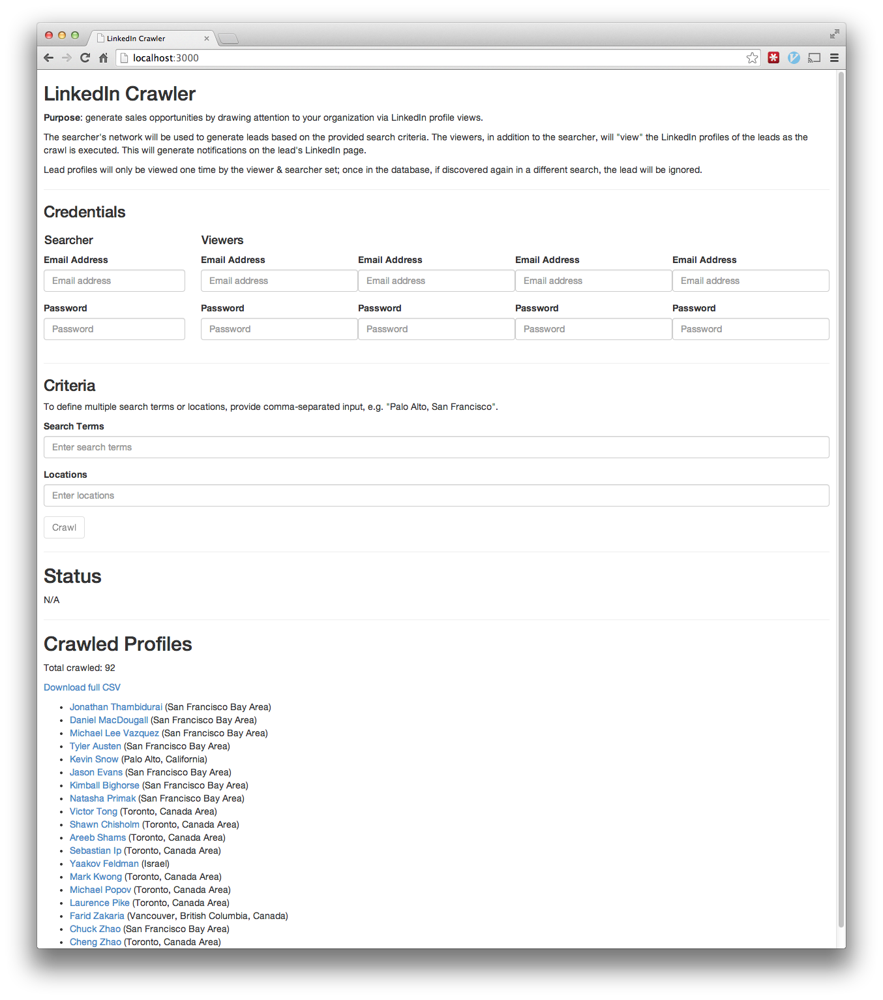

# CRAWLER DO LINKEDIN
👨‍🏫APLICAÇÃO QUE GERA OPORTUNIDADES DE VENDAS AO CHAMAR A ATENÇÃO PARA SUA ORGANIZAÇÃO ATRAVÉS DE VISUALIZAÇÕES DE PERFIS NO LINKEDIN.

 <br>

## DESCRIÇÃO:
O aplicativo `CRAWLER DO LINKEDIN` é uma ferramenta desenvolvida em Meteor.js com a finalidade de gerar oportunidades de vendas ao chamar a atenção para sua organização através de visualizações de perfis no LinkedIn. Ele usa a rede de contatos do "searcher" (pesquisador) para gerar leads com base em critérios de busca fornecidos e realiza visualizações de perfis LinkedIn desses leads, tanto pelo "searcher" quanto por "viewers" (visualizadores) adicionais. Essas visualizações geram notificações na página do LinkedIn dos leads, aumentando a visibilidade.

## FUNCIONALIDADES:
1. **Autenticação:**
   - Permite ao "searcher" e aos "viewers" fornecerem suas credenciais de LinkedIn (e-mail e senha) para que o aplicativo possa fazer login e executar a pesquisa e visualizações.

2. **Critérios de Busca:**
   - Usuários podem definir palavras-chave e locais para a busca de perfis no LinkedIn.
   - Permite múltiplas palavras-chave e locais, separados por vírgulas.

3. **Visualizações de Perfis:**
   - Visualiza os perfis dos leads encontrados de acordo com os critérios de busca.
   - Garante que cada perfil de lead será visualizado apenas uma vez pelo "searcher" e pelos "viewers".

4. **Status e Resultados:**
   - Mostra o status atual do processo de busca e visualização.
   - Exibe o número total de perfis visualizados.
   - Permite baixar uma lista completa dos leads visualizados em formato CSV.

## EXECUTANDO O PROJETO:
1. **Instalando as Dependências:**
   - Para instalar as dependências listadas no arquivo `package.json`, você pode usar o comando `npm install` no terminal. Certifique-se de estar no diretório `CODIGO` e execute o seguinte comando:
   ```bash
   npm install
   ```

2. **Executando o Aplicativo:**
   - Para iniciar o aplicativo, execute o seguinte comando:
   ```bash
   meteor
   ```

   - Acesse o aplicativo no navegador visitando [http://localhost:3000/](http://localhost:3000/).

3. **Interagindo com o Aplicativo:**
    1. **Configuração Inicial:**
        - Insira as credenciais de login do LinkedIn para o "searcher" e até quatro "viewers".

    2. **Definição de Critérios de Busca:**
        - Insira as palavras-chave e os locais de interesse para a busca de perfis no LinkedIn.

    3. **Iniciar a Crawler:**
        - Após configurar as credenciais e os critérios de busca, clique no botão "Crawl" para iniciar o processo. (Nota: No código fornecido, o botão está desabilitado por padrão, precisando de ajustes para ser habilitado).

    4. **Monitoramento e Resultados:**
        - Acompanhe o status do processo de visualização no painel de status.
        - Verifique os perfis visualizados e baixe o arquivo CSV com a lista completa dos leads visualizados.

## NÃO SABE?
- Entendemos que para manipular arquivos em `HTML`, `CSS` e outras linguagens relacionadas, é necessário possuir conhecimento nessas áreas. Para auxiliar nesse aprendizado, oferecemos cursos gratuitos disponíveis:
* [CURSO DE HTML E CSS](https://github.com/VILHALVA/CURSO-DE-HTML-E-CSS)
* [CURSO DE JAVASCRIPT](https://github.com/VILHALVA/CURSO-DE-JAVASCRIPT)
* [CURSO DE METEORJS](https://github.com/VILHALVA/CURSO-DE-METEORJS)
* [CURSO DE BOOTSTRAP](https://github.com/VILHALVA/CURSO-DE-BOOTSTRAP)
* [CONFIRA MAIS CURSOS](https://github.com/VILHALVA?tab=repositories&q=+topic:CURSO)

## CREDITOS:
- [PROJETO CRIADO PELO "daleysoftware"](https://github.com/daleysoftware/linkedin-crawler)
- [PROJETO EDITADO PELO VILHALVA](https://github.com/VILHALVA)
